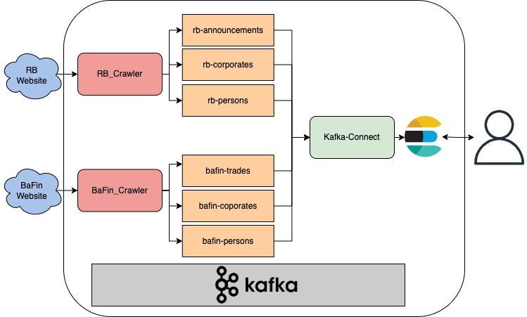

# hpi-ii-project-2022

## Architecture



## Setup

This project uses [poetry](https://python-poetry.org/) as a build tool.
To install all the dependencies, just run `peotry install`.

This project uses Protobuf for serializing and deserializing objects. We provided a
simple [protobuf schema](./proto/bakdata/corporate/v1/corporate.proto).
Furthermore, you need to generate the Python code from the proto file.
To do so run the [`generate-proto.sh`](./generate-proto.sh)
script.
This script uses the Protobuf compiler to generate the model class under the `build/gen/bakdata/corporate/v1` folder
with the name `corporate_pb2.py`.

## Run

### Infrastructure

Use `docker-compose up -d` to start all the services: Zookeeper, Kafka, Schema Registry, Kafka Rest Proxy, Kowl,
Kafka Connect, and Elasticsearch.
After all the services are up and running you can use the [`create-topic.sh`](./rb_crawler/scripts/create-topic.sh)
script to create the `corporate-events` topic.
This script uses the [Kafka REST Proxy](https://github.com/confluentinc/kafka-rest) to communicate with Kafka.

### Kafka Connect

After all the services are up and running, you need to configure Kafka Connect to use the Elasticsearch sink connector.
The config file is a JSON formatted file. We provided a [basic configuration file](./connect/elastic-sink.json).
You can find more information about the configuration properties on
the [official documentation page](https://docs.confluent.io/kafka-connect-elasticsearch/current/overview.html).

### RB Crawler

The Registerbekanntmachung crawler reads the corporates events and produces a message to the `corporate-events` topic.
You can start the crawler with the command below:

```shell
python rb_crawler/main.py [RB_ID]
```

The `RB_ID` argument is an integer, which determines the initial event to be crawled.
The default value is [367482](https://www.handelsregisterbekanntmachungen.de/skripte/hrb.php?rb_id=367482&land_abk=be).

## Query data

### Kowl

[Kowl](https://github.com/redpanda-data/kowl) is a web application that helps you manage and debug your Kafka/Redpanda
workloads effortlessly. You can create, update, and delete Kafka resources like: Topics, Kafka Connect configs.
You can see Kowl's dashboard in your browser under http://localhost:8080.

### Elasticsearch

To query the data from elastic search you can use
the [query DSL](https://www.elastic.co/guide/en/elasticsearch/reference/7.17/query-dsl.html) of elastic. For example:

```shell
curl -X GET "localhost:9200/_search?pretty" -H 'Content-Type: application/json' -d'
{
    "query": {
        "match": {
            "id": "F1103R_HRB74500"
        }
    }
}
'
```
